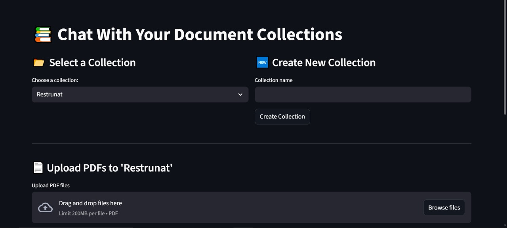
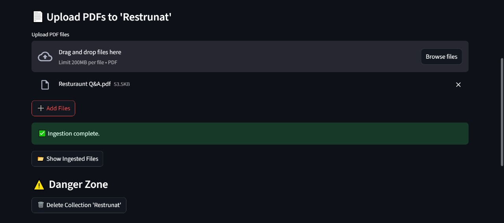
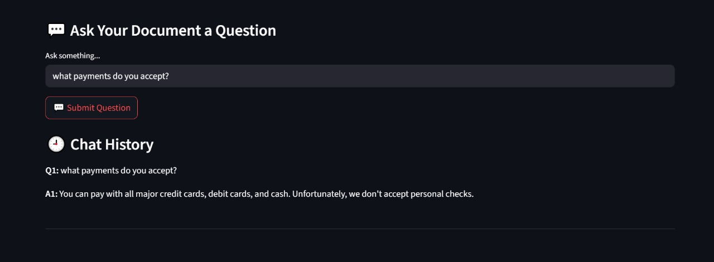

# Multi-Collection RAG Chatbot (Local, Ollama-Based)

A fully local Retrieval-Augmented Generation (RAG) chatbot built with Streamlit, LangChain, and Ollama. This project allows you to create and chat with multiple document collections, each backed by its own FAISS vector index and conversational memory.

---

## Features

- Create and manage named collections
- Upload multiple PDF files to each collection
- Chat with documents using LLM-powered responses
- Full chat history per collection
- Ingestion feedback and file listing
- Local-only: No external APIs required
- Uses Ollama to run LLMs and embedding models locally

---

## Tech Stack

| Component   | Tool/Model                     |
|------------|--------------------------------|
| UI         | Streamlit                      |
| LLM        | Ollama (`llama3.2:latest`)     |
| Embeddings | Ollama (`nomic-embed-text`)    |
| Vector DB  | FAISS                          |
| Backend    | LangChain                      |
| Parsing    | PyPDF                          |

---

## Setup Instructions

### 1. Clone the repository
```bash
git clone https://github.com/KhaNerd1/multi-rag-chat.git
cd multi-rag-chat
```

### 2. Install dependencies
```bash
pip install -r requirements.txt
```

### 3. Run Ollama and pull required models
```bash
ollama run nomic-embed-text:latest
ollama run llama3.2:latest
```

### 4. Launch the application
```bash
streamlit run app.py
```

---

## Usage

- Start the app and create a new collection
- Upload one or more PDF files to that collection
- The files will be ingested and stored locally using FAISS
- Ask questions related to the uploaded files
- View chat history for each collection
- List or delete collections at any time

---

## Directory Structure

```
├── app.py               # Main Streamlit UI
├── rag_chain.py         # RAG logic and chain creation
├── utils.py             # Helper functions (file and collection management)
├── collections/         # Auto-generated FAISS indexes
├── requirements.txt     # Python dependencies
└── README.md
```

---

## Sample File Included

The repository includes a sample PDF file:

- `Resturaunt Q&A.pdf` – A sample document containing restaurant-related questions and answers. You can upload this file to a new collection and start chatting with it immediately to test the system.

## 📸 Example Screenshots

### 1. Select or Create a Collection


### 2. Upload a PDF and Ingest


### 3. Chat With Your Documents



